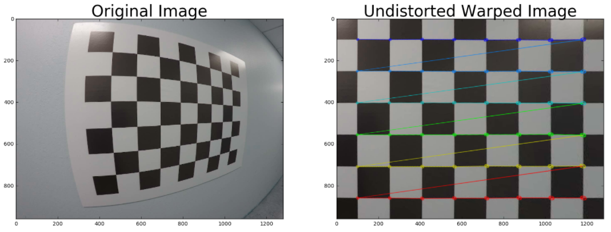
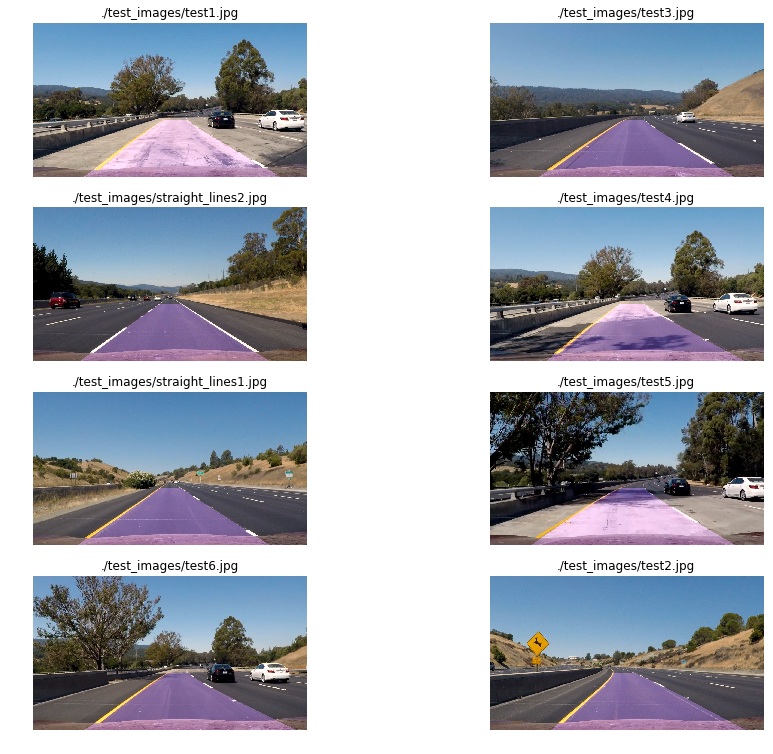

## Udacity Self-Driving Car Engineer Nano Degree Project-2 (Advanced Lane Finding)
[](http://www.udacity.com/drive)

>>>>>>> 92d13c19d7812954c3f9a57f029cfdaf8a057484

The goals / steps of this project are the following:

1-Compute the camera calibration matrix and distortion coefficients given a set of chessboard images.

2-Apply a distortion correction to raw images.

3-Use color transforms, gradients, etc., to create a thresholded binary image.

4-Apply a perspective transform to rectify binary image ("birds-eye view").

5-Detect lane pixels and fit to find the lane boundary.

6-Determine the curvature of the lane and vehicle position with respect to center.

7-Warp the detected lane boundaries back onto the original image.

8-Output visual display of the lane boundaries and numerical estimation of lane curvature and vehicle position.

The images for camera calibration are stored in the folder called `camera_cal`.  The images in `test_images` are for testing your pipeline on single frames.  If you want to extract more test images from the videos, you can simply use an image writing method like `cv2.imwrite()`, i.e., you can read the video in frame by frame as usual, and for frames you want to save for later you can write to an image file.  

To help the reviewer examine your work, please save examples of the output from each stage of your pipeline in the folder called `output_images`, and include a description in your writeup for the project of what each image shows.    The video called `project_video.mp4` is the video your pipeline should work well on.  

The `challenge_video.mp4` video is an extra (and optional) challenge for you if you want to test your pipeline under somewhat trickier conditions.  The `harder_challenge.mp4` video is another optional challenge and is brutal!

If you're feeling ambitious (again, totally optional though), don't stop there!  We encourage you to go out and take video of your own, calibrate your camera and show us how you would implement this project from scratch!

Camera Calibration 
---
**1. Compute camera matrix and distortion coefficients.**

Using ```cv2.findChessboardCorners```, the corners points are stored in an array imgpoints for each calibration image where the chessboard could be found. The object points will always be the same as the known coordinates of the chessboard with zero as 'z' coordinate because the chessboard is flat. The object points are stored in an array called ```objpoints.``` I then used the output objpoints and imgpoints to compute the camera calibration and distortion coefficients using the ```cv2.calibrateCamera``` function. 

The image below depicts the results of applying ```cv2.undistort```, using the calibration and distortion coefficients, to one of the chessboard images:

 


## Pipeline (single images)

**1. Example of a distortion-corrected image.**


***2. Methods to create a thresholded binary image.***

Pipeline contains combination of color and gradient thresholds to generate a binary image (thresholding steps at cell #5 through #7.

Step 1: Apply Sobel on x-axis (calculate directional gradient and apply gradient threshold)

Step 2: Apply Sobel on y-axis

Step 3: Apply Sobel x and y, compute the magnitude of the gradient and apply a threshold

Step 4: Apply Sobel x and y, computes the direction of the gradient and apply a threshold

Step 5: Combine the thresholds from steps 1-4

Step 6: Threshold color channel (S channel from HLS color space)

Step 7: Combine color and gradient thresholds (steps 5-6)

Results:


The full combination of these gradients leads to a "noisy" binary image. That is why on the main notebook Advanced Lane Lines notebook. Only the combination of Sobel X and Sobel Y was used to continue with the pipeline. The following image shows the binary image obtained with that combination on the test images:


***3. Perspective transform.***


The code for perspective transform includes a function called ```warp()```, which appears in the Python notebook. The ```warp()``` function takes as inputs an image (thresholded). The source and destination points were hardcoded in the following manner:

src = np.float32([[180, img.shape[0]], [575, 460], [705, 460], [1150, img.shape[0]]])

dst = np.float32([[320, img.shape[0]], [320, 0], [960, 0], [960, img.shape[0]]])

This resulted in the following source and destination points:

| Source        | Destination   | 
|:-------------:|:-------------:| 
| 585, 460      | 320, 0        | 
| 203, 720      | 320, 720      |
| 1127, 720     | 960, 720      |
| 695, 460      | 960, 0        |

Draw the src and dst points onto a test image and its warped counterpart to verify that perspective transform works as expected. Lines appear parallel in the warped image:


Four points where selected on the first image as the source of the perspective transformation. Those points are highlighted on the following image


The transformation matrix and the inverse transformation matrix was stored using pickle to be used on the main notebook Advanced Lane Lines notebook. The following picture shows the binary images results after the perspective transformation:


***4. Identify lane-line pixels and fit their positions with a polynomial.***

his step implemented in the function detect_lines()

Steps to fit lane lines with a 2nd order polynomial:

***Step 1***: Find the starting point for the left and right lines (take a histogram of the bottom half of the masked image)


***Step 2:*** Set the width of the windows +/- margin (= 100), set minimum number of pixels found to recenter window (= 50)

***Step 3:*** If lines are not detected - step through the windows one by one


***Step 4:*** Extract left and right line pixel positions and Fit a second order polynomial to each (using np.polyfit

***Step 5:*** Generate x and y values for plotting


***5. Calculate the radius of curvature of the lane and the position of the vehicle with respect to center. ***

On the step 4 a polynomial was calculated on the meters space to be used here to calculate the curvature. The formula is the following:

((1 + (2*fit[0]*yRange*ym_per_pix + fit[1])**2)**1.5) / np.absolute(2*fit[0])
where fit is the the array containing the polynomial, yRange is the max Y value and ym_per_pix is the meter per pixel value.

To find the vehicle position on the center:

Calculate the lane center by evaluating the left and right polynomials at the maximum Y and find the middle point.
Calculate the vehicle center transforming the center of the image from pixels to meters.
The sign between the distance between the lane center and the vehicle center gives if the vehicle is on to the left or the right.
The code used to calculate this could be found at In [20].


***6. Result plotted back down onto the road such that the lane area is identified clearly.***

I implemented this step in the code cells titled "Draw the Detected Lane Back onto the Original Image" and "Draw Curvature Radius and Distance from Center Data onto the Original Image" in the Jupyter notebook. A polygon is generated based on plots of the left and right fits, warped back to the perspective of the original image using the inverse perspective matrix Minv and overlaid onto the original image. The image below is an example of the results of the draw_lane function:




Below is an example of the results of the draw_data function, which writes text identifying the curvature radius and vehicle position data onto the original image:


## Pipline (video)

1. Provide a link to your final video output. Your pipeline should perform reasonably well on the entire project video (wobbly lines are ok but no catastrophic failures that would cause the car to drive off the road!).
After some refactoring of the code found at In [21], the project video was processed and the results at video_output


## Discussion

Difficulties:
Pipeline becames relatively nonstable in cases of very fast turns and difficult light conditions (experimental way to fix this issue is to use high light sensitive camera with high fps values).

What could be improoved:
Drawing procedure could be improved by adding stabilization features

More experiments with threshold values and color spaces (and different combination of both) could be performed

Include additional information on each frame (statistics, etc.)


